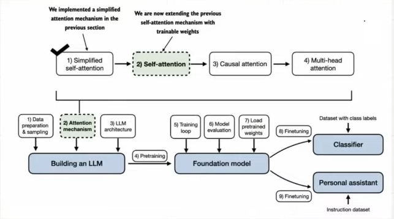
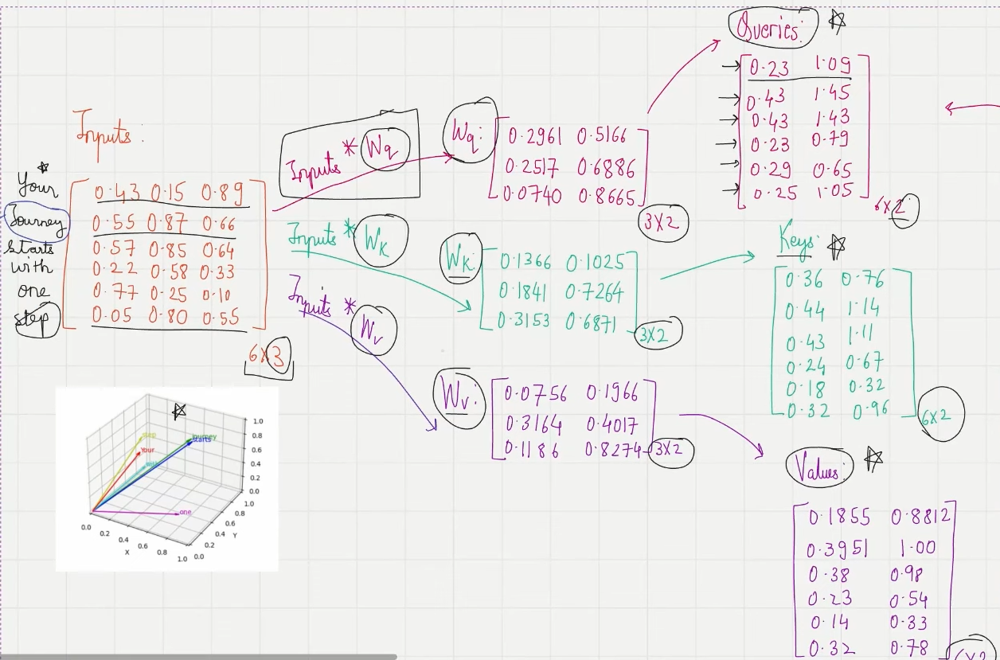

# Self attentions with trainable weights

In this lecture, we learn about the self-attention mechanism used in the original transformer, the GPT models and other popular LLMs

This self attention mechanism s also called `scaled dot-product attention`

**Objectives of this lecture**

1. Compute context vectors as weighted sums over the input vectors specific to a certain input elementt
2. Introduce weight matrics that are updated during model training
3. These trainable weights matrics are crucial so that the model can learn to produce `good` context vectors
4. Implement the self-attention mechanism step by step by introducting 3 trainable weight: `Wq`, `Wk` and `Wv`
   - These 3 matrics are used to project the embedded input token `x(i)` into `query`, `key` and `value` vectors

> Just as a reminder, the context vector is taught of as the `enriched embeddings`, it not only contains information and semantic meaning about each token, but also contains information about how each and every embeddings relates to each other

> The goal is still the same as implemented in the lecture 14... we want to get from `input embeddings` to `context vectors`

### **Steps 1: Converting input embeddings into `query`, `key`, `value ` vectors**

- so we first multiply the `input embeddings vectors` by a randomized vectors for the `query`, `key` and `value`. these are the trainable weights. so we'll have
  - `inputs \* wq` -> `queries`
  - `inputs \* wk` -> `keys`
  - `inputs \* wv` -> `values`
- henceforth after we get the queries, keys and values we're not going to look at the inputs embeddings again. they've been transformed into 3 matrixs
