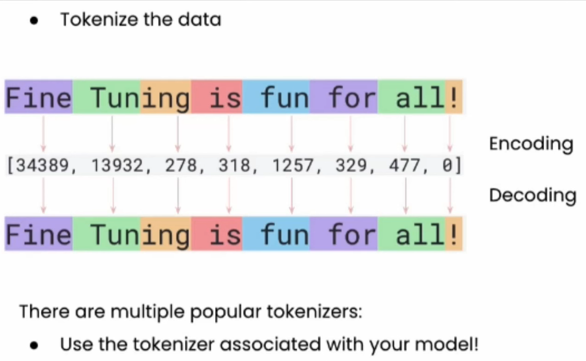

# Basic Intro to Transformers

- The original transformer architecture was developed for machine translations from English text to German and French

## SIMPLIFIED TRANSFORMER ARCHITECTURE

### Steps

1. **Input text**:The input text to be translated

2. **Preprocessing steps**: Input text is the preprocessed, converted into tokens in a process called `tokenization`, img below for the the `encoder`.
   

   - Tokenization is simply breaking down each words in the `input text` into their simplest form.
   - So in this step, the goal here is to prepare the text for the `encoder`

3. **Encoder**: the `encoder` produces text that is used by the `decoder`

   - The encoder creates `vector embeddings`. **the goal is to capture or represent the semantic meaning between the words in the input text and then store them**. that is is the process of `vector embeddings`
     
   - Again the main purpose of the `encoder` is to take in the `preprocessed text(tokens)` and then convert them to `vector embeddings` in `n-dimensional space` such that each word in the input makes sense in that dimensional space. as shown in the image above... such that words which are closer to each other are in the located around in the same vector space.
   - visualization of vector embedding(NB: embedding models are trained for this)
     
     

4. **Embeddings**: `encoder` returns `embeddings vector` as input to the `decoder`

   - now we have these embeddings here are this stage in `n-dimentional space` and these embedding are feed to the `decoder`
   - this step sums up or take it as the first stage of the whole process...

5. **Partial output text**: model completes one word at a time. eg: `Das est ein`

   - at this stage, model begins to predict each word at a time. and after every prediction it takes back the prediction into the architecture again to predict the next word... so as of now `example` has to not been predicted yet

6. So the `partial output` is passed as `input text` again to be preprocessed(converted into tokens for it to be convert into embeddings again). here is the `proprocessing steps` once again

   - Essentially, the `input text`(which is the `partial predicted output`) is preprocessed and prepared for the decoder.
   - 🔁 NB: What Happens During Partial Output Generation

   * As the model **generates each word** (i.e., partial output), that word is:

     1. **Tokenized** (converted into token IDs),
     2. **Embedded** (converted into vectors using the embedding layer),
     3. **Fed back** into the decoder as input for the next prediction.

   * ✅ At every step, the decoder **doesn't just rely on the tokens**. It also uses:

     - The **embedding vectors** (to understand relationships between words in n-dimensional space),
     - The **context from previous steps** (via self-attention).

   * This process happens **iteratively and simultaneously**:

     > Predict → Tokenize → Embed → Decode → Predict next → repeat...

   * That's how the model gradually builds the full output—**one token at a time**, always guided by both **token meaning (via embeddings)** and **context (via attention)**.

7. **Decoder**: generates translated text one word at a time.

   - so now here, the text are being processed are now in the vector space... the `decoder` has to now predict the next word from the `vector space` from all the dataset that was placed in the vector space.

8. **Output layers**: Complete the output translations say outputs the translation. eg: `Das est ein Beispiel`. thus, the next word(or probably the last word) has been predicted and added.

## Transformer architecture consist of `ENCODER` & `DECODER`

- **Encoder**: encodes input text into vector embeddings
- **Decoder**: generates output text from encoded vectors
- **NB**: A note of `self-attention mechanism`:
  - Key part of transformers. Allows the model to weigh the importance of different words/tokens relative to each other
  - Enables model to capture long range dependencies.

## Later variations of transformer architecture

- **BERT(Bidrectional Encoder Representation from Transformers)**: Predicts hidden words in a given sentence.
  - BERT uses only `encoders`
    
- **GPT(Generative Pretrained Transformers)**: Generate new words
  - On the the other hand, GPT uses only `decoders`
    

## Transformers vs LLMs

- Not all transformers are LLMs
- Transformers can also be used for Computer Vision
  

- Not all LLMs are transformers
- LLMs can be based on recurrent or convolutional architectures as well.
  
