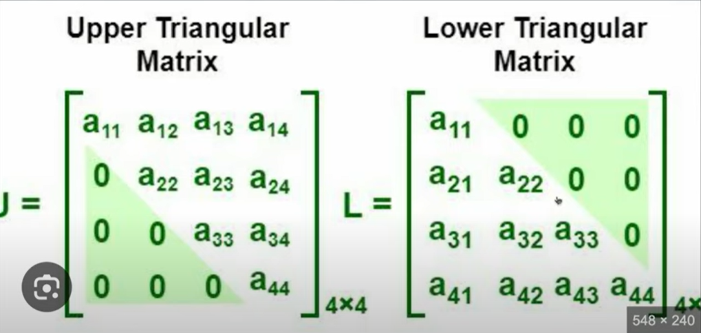

# **Causal attention**

### my notes

- Causal attention is also known as `masked attention`
- Is it a special form of self-attention where we restricts the model to only consider previous and current inputs in a sequence, when processing any given token.
- This is in contrast to the self attention mechanism, which allows access to the entire input sequnce at once
- When computing attention scores, the causal attention mechanism ensures that the model only factors in tokens that occurs at or before the current token in the sequence
- To achieve this in GPT like LLMs, for each token processed, **we mask out the future tokens, which come after the current token** in the input text.


- we mask out the attention weights(from the image above) diagonal, and we normalise the non-masked attention weights, such that the attention weight sum up to 1 in each row

---

### 🧠 Why Causal Attention Exists

Causal attention enforces the **autoregressive property** — that when the model predicts the next token at position t, it should **only use information from positions ≤ t** (past and present), and **not "peek" at future tokens** (> t).

This is essential for **language generation**, where the model produces tokens sequentially:

```math
P(x) = \prod_{t=1}^T P(x_t | x_{<t})
```

If the model could access future tokens during training (e.g., while predicting x₄, it sees x₅), it would learn to rely on "cheating" information, which makes training invalid for autoregressive inference.

---

### 🧱 Why Masking Is Done "Diagonally"

In the attention mechanism, we compute a score matrix S = QKᵀ/√dₖ of shape (seq_len, seq_len):

- Each row corresponds to a **query token** (the "current" position)
- Each column corresponds to a **key token** (the "information source" position)

For **causal attention**, we apply a **lower-triangular mask** (including the diagonal). This mask sets the scores for **future positions** (columns to the right of the diagonal) to -∞ before applying softmax.

Example for sequence length 4:

| Query \ Key | 1   | 2   | 3   | 4   |
| ----------- | --- | --- | --- | --- |
| **1**       | ✓   | ✗   | ✗   | ✗   |
| **2**       | ✓   | ✓   | ✗   | ✗   |
| **3**       | ✓   | ✓   | ✓   | ✗   |
| **4**       | ✓   | ✓   | ✓   | ✓   |

✓ = allowed attention (past & self)
✗ = masked (future)

This structure is **diagonal masking**: everything above the main diagonal is masked out.

---

### 🚨 What Would Happen Without Masking

Suppose token at position 3 attends to token at position 4 during training. It would "see" the ground-truth future token, and might learn shortcuts like:

- Predicting punctuation by looking ahead
- Memorizing next words instead of learning language structure

During generation, when token 3 is being produced, **token 4 doesn't exist yet** — so the model would perform worse because the conditions during training don't match inference.

---

### ✨ Summary

- **Causal attention** = enforce autoregressive generation by preventing future-token leakage
- **Diagonal masking** = implement this by zeroing out (masking) attention to future positions in the score matrix before softmax
- This ensures **each token's context is strictly past and current**, matching how we use the model at inference time

## How to apply a causal attention mask

Strategy

- Get attention weights: zero out elements above the diagonal and normalise the resulting matrix
  

### Why masking after softmax causes data leakage

In causal attention, each query token should only attend to itself and past tokens.  
If we apply softmax _before_ masking, the attention weights are already normalised across **all tokens**, including future ones.  
Even if we later zero-out the future weights, the remaining probabilities are still biased because the denominator of softmax included information from those future tokens.

This is data leakage: the model indirectly used information from the future when computing current attention weights.

✅ The fix: apply the causal mask **before** softmax. That way, future tokens are excluded from the distribution entirely, and the attention weights for a query depend only on valid (past + current) tokens.

- We first calculate the attention score
- after we perform the upper triangular infinity masking
  
- lastly we softmax the result
  

### masking additional attention weights with dropouts

- Dropout is a deep learning technique where randomly selected hidden layer units are ignored during training
- this prevents overfitting and improves generalizaion performance
- In transformer architecture, including models like GPT, dropout in the attention mechanism is applied in 2 specific areas
  - after calculating attention scores
  - after applying attention weights to the value vectors
- Applying dropout after calculating attention weights is more common, and we consider that
  
  

---

## AI NOTES

# 🧠 Causal (Autoregressive) Attention — Why Masking Matters

## 📌 Definition: Autoregressive Modeling

A model is said to be **autoregressive** if it uses previously generated tokens as **context** to predict the **next token** in a sequence.  
Formally, the probability of a sequence x = (x₁, x₂, ..., xₜ) is factorized as:

```math
P(x) = \prod_{t=1}^T P(x_t | x_{<t})
```

where x<t denotes all tokens **before position t**.  
This reflects how autoregressive models **generate text step by step**, conditioning only on past tokens.

---

## 🎯 Why Causal Attention Is Needed

During training, we often process entire sequences in **parallel** for efficiency.  
However, a vanilla self-attention mechanism allows **every token to attend to every other token** — including **future tokens**.

For autoregressive models (e.g., GPT), this is a **problem** because:

- When predicting token xₜ, the model must **not have access** to tokens xₜ₊₁, xₜ₊₂, ...
- If future tokens are visible, the model can "cheat" by relying on information it wouldn't have during real generation.
- This leads to **data leakage** and a mismatch between **training and inference**.

---

## 🧱 Mechanics: Attention Score Matrix

The raw attention scores are computed as:

```math
S = \frac{QK^T}{\sqrt{d_k}}
```

where:

- Q = Query matrix
- K = Key matrix
- d_k = dimensionality of keys

S is a square matrix of shape (sequence length, sequence length), where each row corresponds to a **query token**, and each column corresponds to a **key token** it can attend to.

## 🚫 Applying the Causal Mask

To enforce causality, we apply a **causal mask** to S, typically an **upper-triangular mask** with `-inf` above the diagonal:

```python
mask = torch.triu(torch.ones(context_length, context_length), diagonal=1)
masked_scores = S.masked_fill(mask.bool(), float('-inf'))
```

This masking ensures that **token t** can only attend to **tokens ≤ t**.
After masking, we apply softmax:

```math
\text{AttentionWeights} = \text{softmax}(\text{MaskedScores})
```

The `-inf` values ensure that attention weights for **future positions** become **zero** after softmax.

---

## 🧠 Intuition Recap

- ✅ **Before masking**: Token at position 3 could attend to token 5 — leaking future info.
- ✅ **After masking**: Token at position 3 can only attend to tokens 1, 2, and 3 (itself).
- ✅ This enforces **autoregressive behavior**, aligning **training** with **generation** time.

---

## ✍️ Summary

- Autoregressive models generate tokens **sequentially**.
- Causal attention uses **masking** to **block future tokens** during attention.
- This prevents **data leakage** and ensures the model learns to **predict next tokens based only on past context**.
- The **upper-triangular mask** is the core trick enabling parallel training while maintaining the sequential dependency structure.

---
