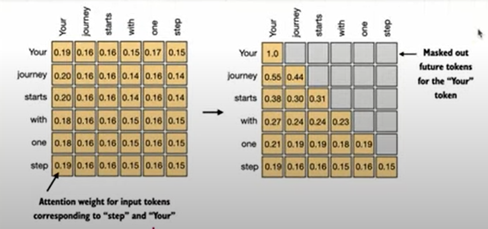
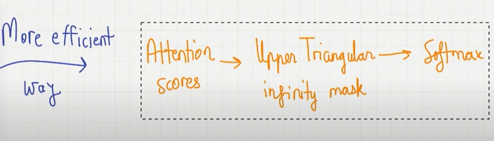
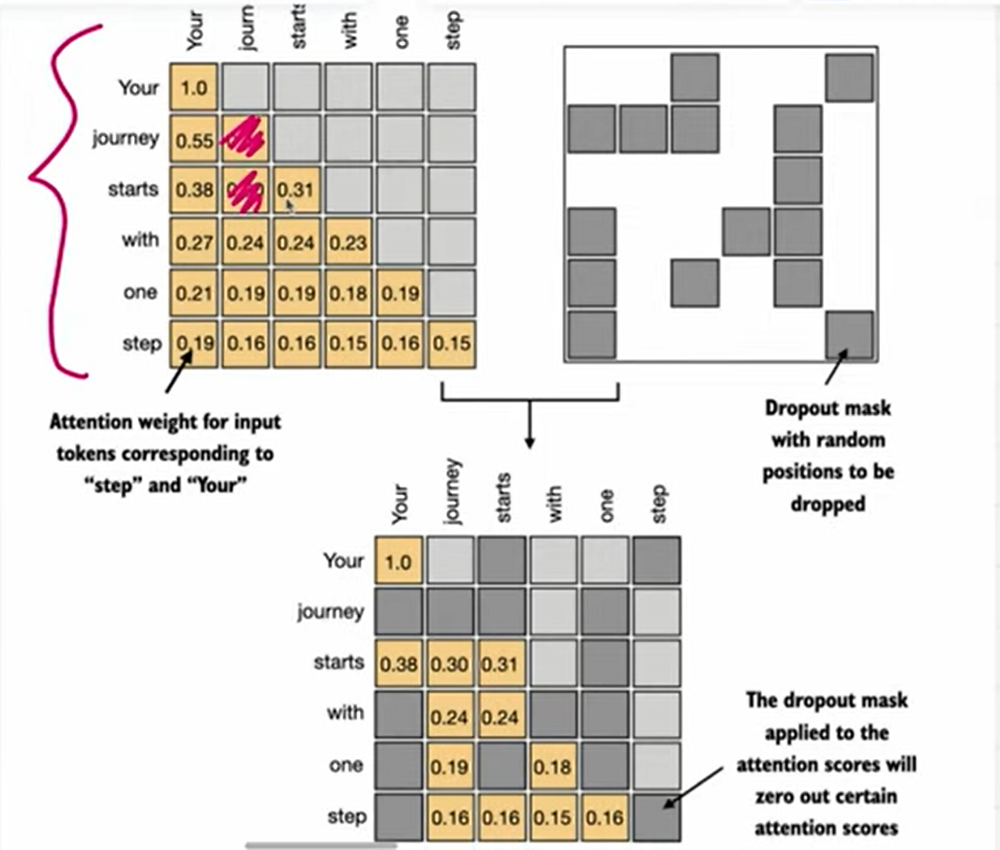
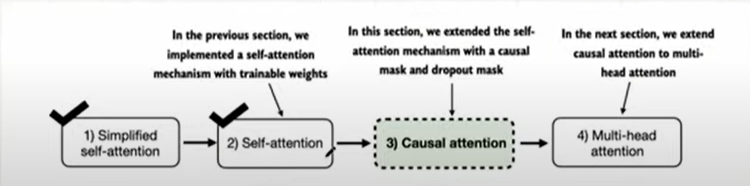

# **Causal attention**

- Causal attention is also known as `masked attention`
- Is it a special form of self-attention where we restricts the model to only consider previous and current inputs in a sequence, when processing any given token.
- This is in contrast to the self attention mechanism, which allows access to the entire input sequnce at once
- When computing attention scores, the causal attention mechanism ensures that the model only factors in tokens that occurs at or before the current token in the sequence
- To achieve this in GPT like LLMs, for each token processed, **we mask out the future tokens, which come after the current token** in the input text.

- we mask out the attention weights(from the image above) the diagonal, and we normalise the non-masked attention weights, such that the attention weight sum up to one in each row

## How to apply a causal attention mask

Strategy

- Get attention weights: zero out elements above the diagonal and normalise the resulting matrix
  

TODO: MAKE POINT BELOW MORE CLEARER

- data leakage issue: the previous approach causes data leakage at the attention weights have already been softmax which contains the deatails of the other attentions weights. so even if we mask them out and then normalise them again the ones left are as result of already attention weights are affected by all token/words in the query. but we only need the attention weights for the current query and the previous ones only.

### Why masking after softmax causes data leakage

In causal attention, each query token should only attend to itself and past tokens.  
If we apply softmax _before_ masking, the attention weights are already normalised across **all tokens**, including future ones.  
Even if we later zero-out the future weights, the remaining probabilities are still biased because the denominator of softmax included information from those future tokens.

This is data leakage: the model indirectly used information from the future when computing current attention weights.

✅ The fix: apply the causal mask **before** softmax. That way, future tokens are excluded from the distribution entirely, and the attention weights for a query depend only on valid (past + current) tokens.

- We first calculate the attention score
- after we calulate the upper triangular infinity mask
- lastly we softmax the result
  

### masking additional attention weights with dropouts

- Dropout is a deep learning technique where randomly selected hidden layer units are ignored during training
- this prevents overfitting and improves generalizaion performance
- In transformer architecture, including models like GPT, dropout in the attention mechanism is applied in 2 specific areas
  - after calculating attention scores
  - after applying attention weights to the value vectors
- Applying dropout after calculating attention weights is more common, and we consider that
  
  
