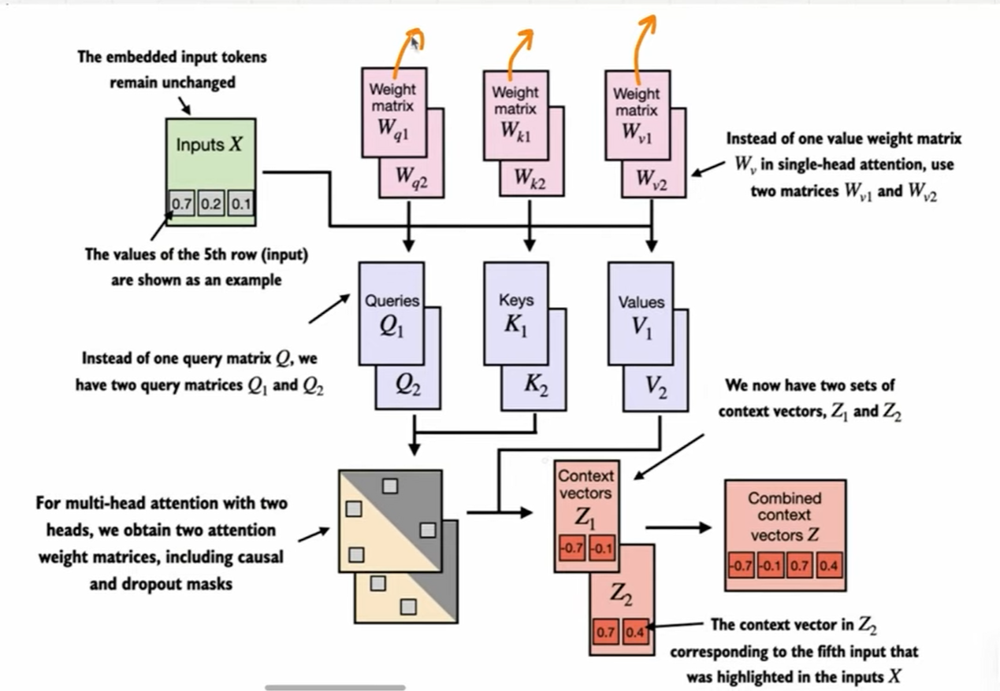
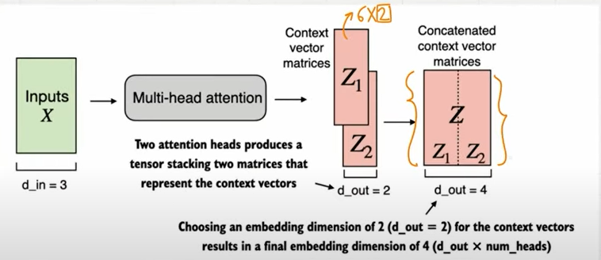

# Multi-head Attention Part 1: Basics & Python Code

- There are 2 types of multi-head attention

  - concatenating the context vector matrix obtained from the different QKV matrix
  - processing all in parallel with weight splits

- The term `multi-head` refers to dividing the attention mechanism into multiple heads(each operating independently)
- **the main goal of any attention mechanism is to start from `input vectors` and convert them to into `context vectors`**

- In multi-head attention, we stack multiple single head attention layers
  - Implementing mult-head attention involves creating multiple instances of the self-attention mechanism; **each with it's own weights, and then combining their outputs**
  - This can be computationally intensive, but it makes LLMs powerful at complex pattern recognition tasks
    
    

> MAIN IDEA: We're running the attention mechanism multiple times(in parallel) with different, learned linear projections: the results of multiplying inputs data(like query, key & value vectors) by a weight matrix
