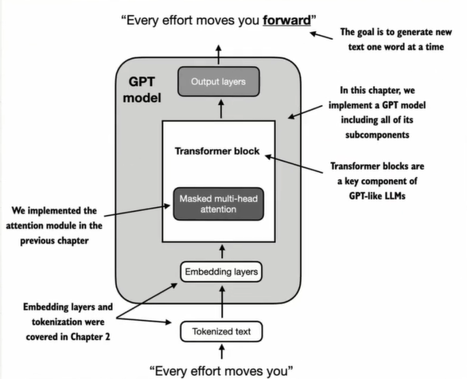
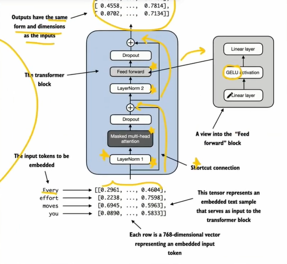
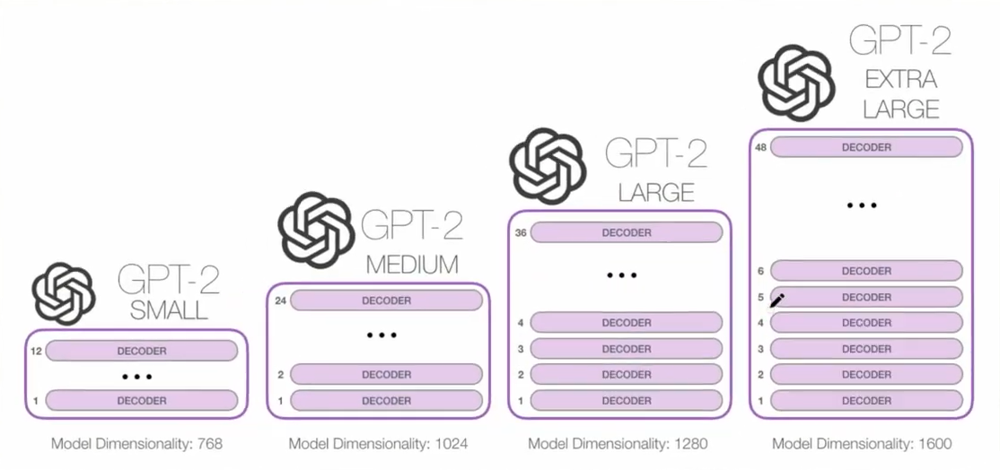

# Birds Eye View of the LLM Architecture

So far we've covered from `preparation & sampling` to `attention mechanism`
In this part we'll be learning about the the `LLM Architecture`.

below is an image of the bird eye view of LLM GPT like architecture.

now from this image you realise what we've done so far from tokenization to embeddings and then to the transformer block where we coded out multi-head attention from scratch. This image helps use appreaciate what we've done so far and helps us see the big picture of what we've coded our so far from tokenization till now.

once to remind ourself the goal of the attention is to convert the input embedding vectors into context vectors that captures the semantic meaning of the token and also how each token relate to each other from all the other tokens in the sentence

now we zoom in to the `transformer block`. so the image below shows the transformer block zoomed in. there we find the the input vectors first going through the `layer normalization, layer norm` and through the masked multi-head attention and then a dropout layer. followed by that is shortcut connection. right after the shortcut connect we have another `layer norm` and then a `feed forward`(which contain a linear layer -> GELU activation -> linear layer once again) after that we get the dropout an then the a shortcut connection again then we get our final out.


in this lecture we'll learn about why these connections and then from the subsequent lectures, we delve into all the other part of the components of the architecture into detail. we have already convered the attention part in the previous 4-5 lectures into detail.

So up until now, what we've learnt so far is

a. Input tokenization (medium part 2)
b. Embeddings(Token + positional) (part 4)
c. Masked multi-head attention (part 6 - 9)

What we are yet to learn:
a. is the transformer block: we'll delve in slower and deeper into every componenet of this block from layer norm, droptout, shortcut connection, feed forward(linear layer and GELU activation) and more...

so for the 4-5 lecture we'll be using the GPT-2 model withe `124 million parameters` with `12 layers of attention blocks` and `768 vector dimension`

we are using GPT-2 SMALL because it is smaller and it better to run is locally on our local machine and also Open AI has made it weights public. higher model like GPT 3, 4 and 5 are closed sourced and have not been disclosed to the public.
open source model like Meta llma, qwen, gemma etc.. have all their weight released
the model config for gpt 2 is as below


```
GPT_CONFIG_124M = {
    "vocab_size": 50257,    # Vocabulary Size
    "context_length": 1024,     # Context length
    "emb_dim": 768,         # Embedding dimension
    "n_heads": 12,          # Number of attention heads
    "n_layers": 12,         # Number of layers
    "drop_rate": 0.1,       # Dropout rate
    "qkv_bias": False,      # Query-Key-Value bias
}
```

so right with the configuration above, we'll build a GPT placeholder architecture (dummy GPT model). this will give us a birds eye view of how everythin fits together. this will be in lecture notebook 19.ipynb
